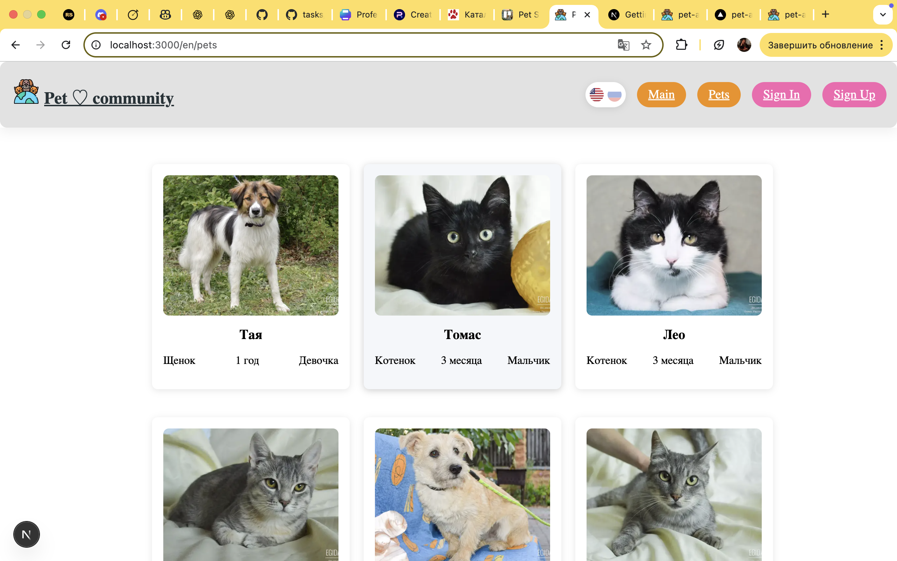

### Pet Adopting Platform

**A modern web application that connects homeless pets with caring owners.**

---

### 🌟 Overview

**Pet Adopting Platform** is a responsive and multilingual web application built with **React, TypeScript, Next.js, RTK Query, Firebase**, and **SCSS Modules**.
It offers catalogs of pets available for adoption across various platforms, shelters, and foster homes in Belarus, making the process of rescuing a pet quick and easy.

---

### ✨ Features

- 🐶 **Pet catalog** – view detailed profiles with photos, story, and adoption details.
- 🌍 **Multilingual support (EN/RU)** – instant language switch for accessibility.
- ⚡ **Pagination & caching** – powered by RTK Query for optimized data loading.
- 🔐 **Firebase integration** – authentication and secure data management.
- 🎨 **Responsive design** – clean, modern UI with SCSS Modules.

---

### 🚧 In Progress

- 🔍 **Search & filtering** – browse by type or age.
- 🧾 **Adoption requests** – submit and manage applications directly in the app.
- 💾 **Favorites** – authenticated users can save favorite pets to their personal account.
- 🐶 **Pet catalog** – new homeless pets appear every day.
- Refining SCSS styling and UI animations.

---

### 🧰 Tech Stack

| Category               | Technologies                            |
| ---------------------- | --------------------------------------- |
| **Framework**          | Next.js (App Router), React, TypeScript |
| **State Management**   | Redux Toolkit, RTK Query                |
| **Backend / Auth**     | Firebase                                |
| **Styling**            | SCSS Modules                            |
| **Build & Deployment** | Next.js, Vercel                         |

---

### 🖼️ Screenshots

## 

# 👩‍💻 Aliaksandra Palkhouskaya

**Junior Frontend Developer (React / TypeScript)**
📍 Remote | Minsk
📧 sahvero@gmail.com
🔗 [GitHub](https://www.linkedin.com/in/aliaksandra-palkhouskaya-626a20158/) | [LinkedIn](https://linkedin.com/in/yourprofile)

## 🎯 Summary

I’m a passionate frontend developer focused on building responsive, accessible, and user-friendly web applications. I specialize in **React, TypeScript, and modern web technologies**. I’ve developed several projects, including a REST Client, Pet Shelter, and Pokémon Explorer, and I continuously improve my skills through self-learning. Currently, I’m seeking an opportunity to grow in a team and contribute to meaningful products.

---

## 🛠️ Tech Stack

**Frontend:** React, TypeScript, JavaScript (ES6+), Redux Toolkit, RTK Query, Zustand, Next.js, Vite
**Styling:** CSS Modules, SCSS, TailwindCSS
**Testing:** React Testing Library, Jest, Vitest
**Backend / Database:** Firebase, REST APIs
**Tools:** Git, GitHub, VS Code, Postman, Figma

---

## 🚀 Projects

### ⚡ REST Client Tool

**Stack:** Next.js, TypeScript, Firebase, Zustand
Custom REST client inspired by Postman.
Implemented request history saving, API testing interface, and real-time Firebase data storage.
🔗 GitHub: [https://github.com/makholodova/rest-client-app](#)

---

### 🎮 Pokémon Explorer

**Stack:** React, TypeScript, RTK Query, Redux, Performance, Forms, Context API
Application for exploring Pokémon data with pagination, error handling, and localStorage caching.
Focus on clean UI and API efficiency.
🔗 GitHub: [https://github.com/AliaksaPlh/my-react-project](#)

---

## 🎓 Education

**Frontend Development with React & JavaScript**
**The Rolling Scopes School - JS, React, Node JS Courses** 2024-2025
BSEU Faculty Of Finance And Banking, Economy, 2016 - 2020

---

## 💬 Languages

- **English** — B2
- **Russian** — Native

---

## 💡 Soft Skills

Teamwork • Responsibility • Communication • Attention to Detail • Problem Solving • Willingness to Learn • Self-disciplined

---

## 📁 References
